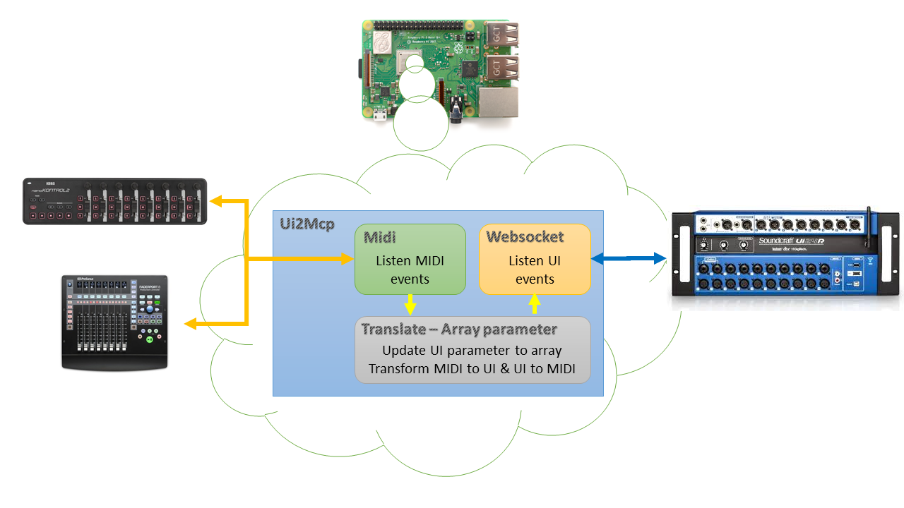

MIDI Controller for Soundcraft Uixx mixing console

The aim of this project is to create a MIDI controller for  [Soundcraft](https://www.soundcraft.com/en/products/ui24r) Ui mixing console with Raspberry.
The controller would connect the MIDI device (control surface) to the Ui console and translate the MIDI commands to the native commands or the opposite way, depending on the settings.
The user can configure the rules to transform.

## Current Status
> The project is currently in the *BETA* phase, the application have several functionnality.
> The application is connected to the UI and connected to MIDI devices.
> The application already listens websocket message and midi raw.
> It shows incoming MIDI messages, the device profile manager update struture varable of UI.
> The base rules drives the controller service that will transform the input to output.

## Current Goals
* Connect to console using IP or address.
* Connect to MIDI devices.
* Read all UI parameters and create UI variables struture.
   UI ----- i ------- mix
     |        |-------- stereoindex
     |        |-------- mute
     |        |-------- solo
     |        |-------- pan
    ~
     |------- a ------ mix
     |        |-------- stereoindex
     |        |-------- mute
     |        |-------- solo
     |        |-------- pan
    ~
* Allow mapping incoming MIDI commands to native commands for the console.
* Allow listening to the console parameters and map them to outgoing MIDI commands.
* Allow configuration sets - settings for each device

## Future goals
* Develop XML config format will creating setting for various common devices.

## Technical details
* nanoKONTROL 2 (Korg) - [Tested device](https://www.korg.com/us/products/computergear/nanokontrol2/)
* FaderPort 8 (Presonus) - [Tested device](https://www.presonus.com/produits/fr/FaderPort-8)
